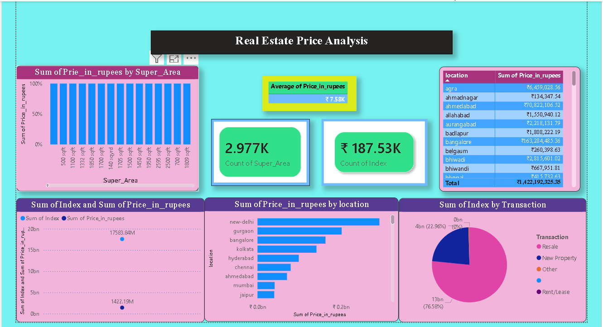

#  Real Estate Price Analysis Dashboard

## Project Overview

This project presents an interactive **Power BI dashboard** for analyzing real estate data.
It provides insights into price trends, location comparisons, and property segmentation.

---

##  Key Features

*  Price Trend Analysis
*  Location-wise Price Comparison
*  Property Segmentation
*  Demand Heatmap
*  Property Type Distribution
*  KPI Cards (Average Price, Total Demand)

---

##  Tools & Technologies

* Power BI
* Data Cleaning & Transformation
* Data Visualization

---

##  Dataset

The dataset contains:

* Price (`Price_in_rupees`)
* Location
* Property Type / Segment
* Area (`Super_Area`, `Carpet_Area`)
* Transaction details

---

##  Dashboard Preview

---

##  Insights

* Major cities like Delhi & Bangalore have higher property prices
* Most properties fall under specific segments (Low/Medium)
* Resale properties dominate the market

---

---

##  Conclusion

This dashboard helps in understanding real estate market trends and supports data-driven decision-making.
